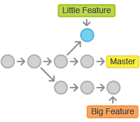

# Git Knock Knock

## Introduction
You will be practicing git and git branching today.

Git is a powerful tool to keep track of changes to your files over time.  You can go back and forth in time, and you can see what you did.

GitHub is a company that specializes in storing git repositories in the cloud and allowing people to share them.

Git branches are a way to protect your code while you are working on features.  Until your code is ready, your changes can be in a branch so that it doesn't break master code, which might be actively used in production.  It also allows multiple people to work on code at the same time, each on their own branch.

*
 

## Game

Git Knock Knock is designed to give you practice in using basic git commands and branches.  

You will be using git to tell knock knock jokes to each other.  Until your partner has merged their changes into master, pushed it up to GitHub, and you have pulled the changes down, you will not see the next line of the joke.

1. Form a pair.
1. Your partner should be in another room.  Use slack to communicate.
1. Each person will choose one knock knock joke.
1. Decide which partner tells the joke first.
1. One person forks the repository and adds the other player as a collaborator. (Go to settings, the Collaborator tab, and search by username)
1. Both people clone the repo in Cloud 9.

Now that set up is done, each person will tell their joke to their partner, line by line.  When it is your turn, follow these steps.

1. Pull the master branch down from GitHub to get any changes your partner made.
1. Cut a new branch (use a different name every time).
1. If you are writing the first line of the joke, create a new file.
1. Add the next line of the joke.
1. Save the file.
1. Add your changes to staging.
1. Commit the change.
1. Pull master down from GitHub again (a precaution - in case it changed).
1. Merge your branch with master.
1. Checkout the master branch.
1. Merge master with your branch.
1. Push master up to GitHub.
1. Tell your partner, "You're it!  Now it's your turn to add a line."


Each person should have a knock knock joke to tell.  Start with one player's knock knock joke.  Then switch.

## Example Workflow

1. One person should fork this repository.
    1. Log on to GitHub, find this repository and click the `Fork` button to create a copy to your own account.
    1. Add the other person as a collaborartor .  Go to the Settings section of the repo, find the Collaborator section, and search for them by GitHub username or email.

1. Clone the repository.
    1. In GitHub on the repository you will share, click the `Clone or download` button and copy the SSH address for the repository (should start with git@github.com).
    1. Log into Cloud 9.
    1. In terminal in Cloud 9 (make sure you are in the root/outermost folder), type `git ` and paste in what you copied from GitHub.  Hit Enter.  Stuff will happen.

   `git clone git@github.com:username/some_repository_name.git`

1. Change your directory into the repository you just cloned.

   `cd git-knock-knock`

1. Create and checkout a branch.  (Instead of `my-branch`, give your branch a name you will remember.)

   `git checkout -b my-branch`

1. Make a change and save it.

1. Add the changed files to staging.  (ie - say, 'yes, those are changes I mean to save')

   `git add .`

1. Commit the change and add a commit message.

   `git commit -m "Made my first change"`

1. Repeat steps 5-7 until your file looks good and your code is tested.

1. Pull down changes from GitHub in case someone on your team has made changes since you started working.

   `git pull origin master`

1. Merge your branch with the master branch. (Instead of `my-branch`, use the name of your branch.)

   `git merge my-branch master`

1. Checkout the master branch.

   `git checkout master`

1. Merge master with your branch to close your branch.

   `git merge master my-branch`

1. Push your changes back to GitHub so that others can see them.

```
  git push origin master
  git push origin my-branch
```


# Git Resources
[Git Glossary](./glossary.md)

# Git Stretches
1. [Git Merging](./practice-merging.md)
1. [Git Revisions](./history.md)