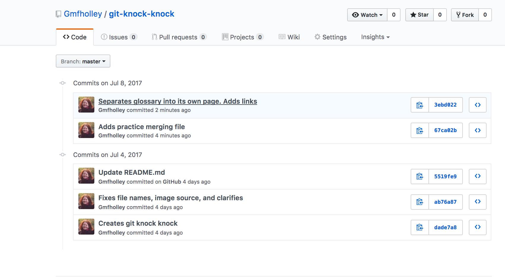
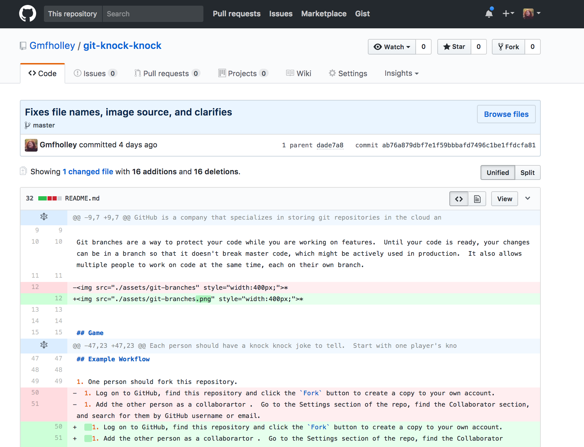

# Git History & Reverting

## Git Log
One of the most useful things to do in git is to go back in time and see what happened.

GitHub provides a good visual history of what happened.  Clicking the `commits` link on any repo will show you the commit history.




If from that list, you click on a commit, you will be taken straight to the difference you saved.  (Remember commits are storing the difference between the previous version and your new version.)

Lines you added are in green.  Removed lines are in red.  If you think you edited a line rather than adding or removing, you'll notice that git has decided it is probably both - an addition (your edited change in its entirety) and a removal (your previous version).



You can also see your changes on command line.

`git log` will show you a history of your commits.

```
➜  git-knock-knock git:(master) git log

commit 3ebd022a61b7c0cdfc72040f93e2193f396a6925
Author: Gmfholley <gmfholley@gmail.com>
Date:   Sat Jul 8 08:20:10 2017 -0500

    Separates glossary into its own page.  Adds links

commit 67ca02b87b04b24e372e32b6c6e1abb7f4e5b77e
Author: Gmfholley <gmfholley@gmail.com>
Date:   Sat Jul 8 08:18:06 2017 -0500

    Adds practice merging file

commit 5519fe9688a7c8577ca56ef099e975803b3b6bbf
Author: Gwendolyn Holley (Wendy) <Gmfholley@gmail.com>
Date:   Tue Jul 4 16:03:16 2017 -0500

    Update README.md

commit ab76a879dbf7e1f59bbbafd7496c1be1ffdcfa81
Author: Gmfholley <gmfholley@gmail.com>
Date:   Tue Jul 4 16:00:47 2017 -0500

    Fixes file names, image source, and clarifies

commit dade7a8282887c1085efdf51b6bc49c01d698be5
Author: Gmfholley <gmfholley@gmail.com>
Date:   Tue Jul 4 15:55:29 2017 -0500

    Creates git knock knock
(END)
```


The long number after commit (`commit 3ebd022a61b7c0cdfc72040f93e2193f396a6925`) is the actual commit number in memory.

Type `:q` to get out of the git log window in command line.

Copy one of your previous commits numbers (not the word commit, just the number).

Now, let's checkout that commit.

## Git Checkout - not just for branches

```
➜  git-knock-knock git:(master) git checkout dade7a8282887c1085efdf51b6bc49c01d698be5
Note: checking out 'dade7a8282887c1085efdf51b6bc49c01d698be5'.

You are in 'detached HEAD' state. You can look around, make experimental
changes and commit them, and you can discard any commits you make in this
state without impacting any branches by performing another checkout.

If you want to create a new branch to retain commits you create, you may
do so (now or later) by using -b with the checkout command again. Example:

  git checkout -b <new-branch-name>

HEAD is now at dade7a8... Creates git knock knock
➜  git-knock-knock git:(dade7a8)
```

You should have the files back as they were when you were on that commit.  You'll notice that your command line has changed so that it's like you're on a branch that is the name of your commit.  That's kind of true!  You can make changes here.  You can make a new branch and change this to the starting point of your repo.  (Although you probably don't want to do that today.)

Play around a little.

When you're ready, go back to master by checking it out.

```
➜  git-knock-knock git:(dade7a8) git checkout master
Previous HEAD position was dade7a8... Creates git knock knock
Switched to branch 'master'
➜  git-knock-knock git:(master) 
```
Your repo should be back to how it was.

## Git Reset - removing uncommitted changes

Sometimes while you're working, but before you've committed, you realize that you don't want to save the change you just made. (But you have already saved and closed the file.)

Or you've adding the wrong files to staging, and you wish you could undo that before committing.

Enter `git reset`!

1. Make a change to two files.  Save the files and close them.
1. Your workspace should be dirty to indicate a change has been made.
1. `git add .` your change to staging.
1. If you did a `git status` now, you would see that your file has been added to staging.
1. `git reset`.  Do a `git status` again.  Your files should be out of staging.
1. `git checkout myfile` will undo the change to a single file.
1. `git reset --hard` will undo all uncommitted changes and give you a clean workspace again.

Practice that a few times.


## Git Revert - undoing a committed change

Commits are not supposed to be undone.  The idea is a sort of scientific purity and transparency.  People can see your mistakes, but mistakes are okay.  They tell people something.  _This didn't work._ 

It's much better to show people mistakes than to pretend they didn't happen.

For that reason, when you correct a mistake using git, you don't erase your old work.  You create a new `head` and say, "That old stuff wasn't good.  It's still there, if you look for it.  But we're going to go this way instead."

We're going to practice resetting the head of your branch, as though we committed a change and then realized we don't care for it.

1. Make any change to your repo.
1. Save your file, add to staging, and commit the change.
1. `git log` to find the number of the last commit you made.  Copy the number of the commit.
1. `:q` to exit git log.
1. Now use git revert: `git revert dade7a8282887c1085efdf51b6bc49c01d698be5`
1. `git log` again.  You should see a new commit in your history now, related to what you did when you `git revert`ed.  But the change you made should be gone.

Now it's part of history, but it's visible to everyone.
